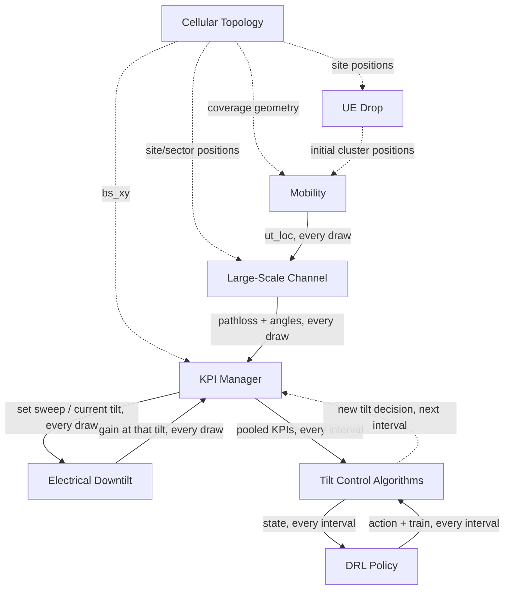
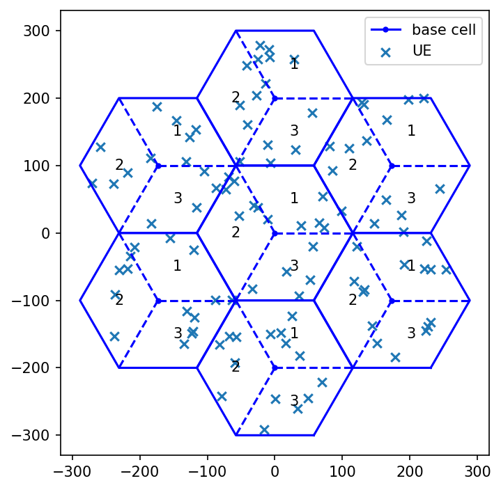
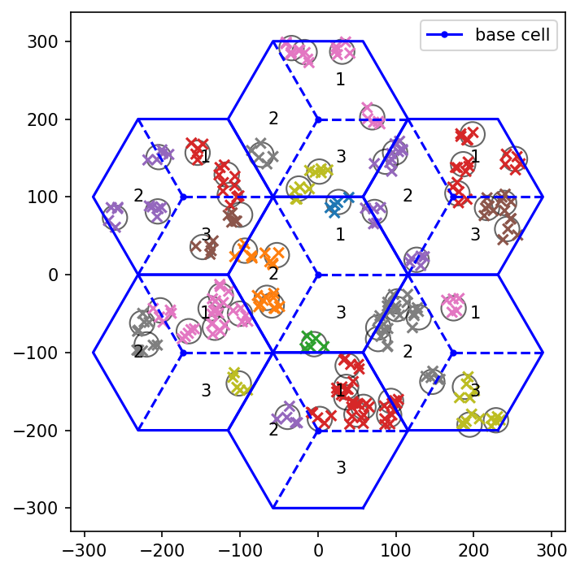
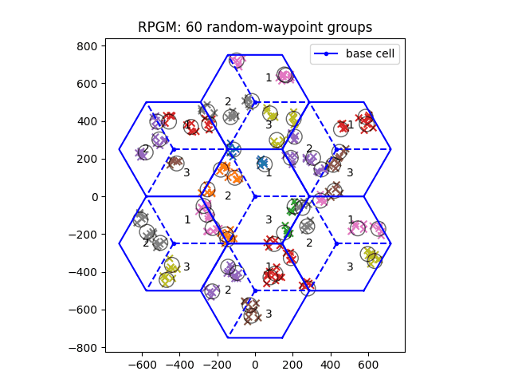
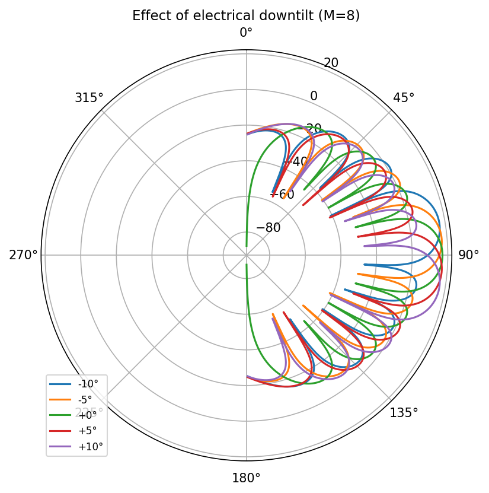
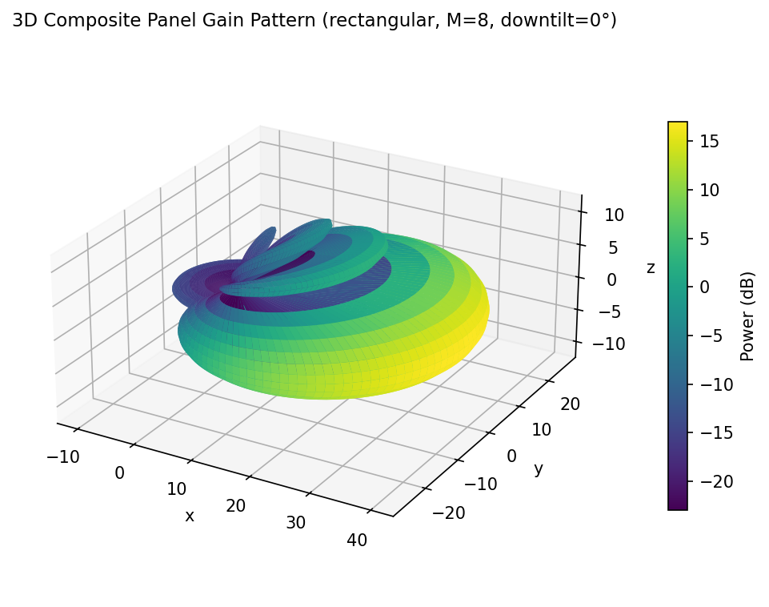
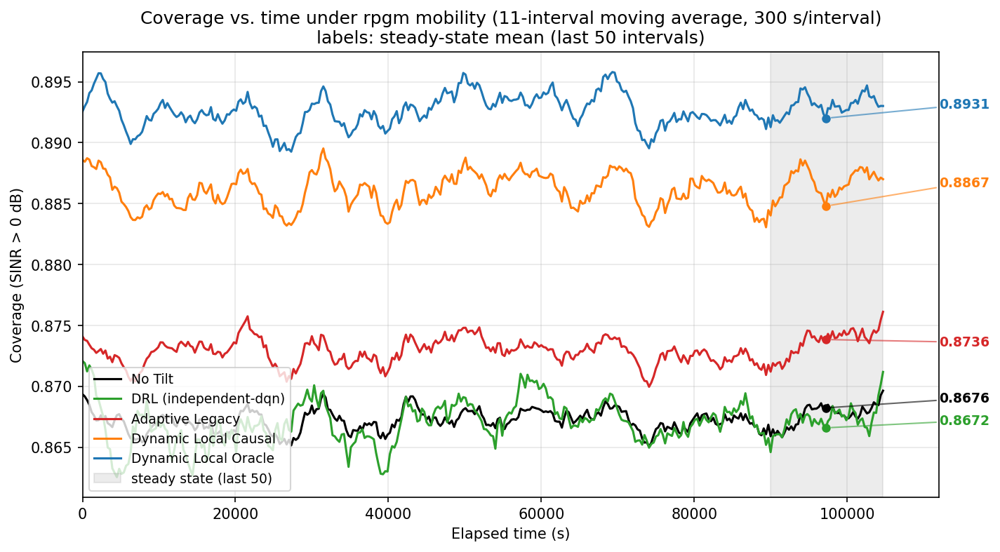

## Goal

This repository implements and compares controllers for Remote Electrical Tilt (RET)
optimization in a simulated cellular network. Each controller observes per-sector KPI
feedback (coverage, SINR, overshoot) and adjusts the electrical downtilt of each sector,
closed-loop, to improve network coverage as UEs move. The comparison spans a non-causal
upper bound, a causal version of the same search, a legacy rule-based controller, a fixed
baseline, and a reinforcement-learning controller.

## Environment Setup

Use the `sionna-wbbf` virtualenv at `/home/shadab/venvs/sionna-wbbf` for everything in
this repo — do not use `/usr/virtualenvs/sionna2`. `sionna2`'s torch build
(`2.10.0+cu128`) has a real cuBLAS bug on this machine's RTX 5090: any batched GEMM
(`set_topology()`/`generate_h_freq()` with `batch_size > 1`, i.e. `max_realization_cuda
> 1`) throws `CUBLAS_STATUS_INVALID_VALUE`. `sionna-wbbf`'s torch (`2.11.0+cu128`) does
not have this bug, confirmed by direct testing.

To create it from scratch (or reproduce it elsewhere):

```bash
python3.12 -m venv /home/shadab/venvs/sionna-wbbf
/home/shadab/venvs/sionna-wbbf/bin/pip install -r requirements.txt
```

To activate it (once per shell session):

```bash
source /home/shadab/venvs/sionna-wbbf/bin/activate
```

Then run the main script:

```bash
python main.py
```

Deactivate with `deactivate`. To run it without activating, call the venv's Python
directly instead: `/home/shadab/venvs/sionna-wbbf/bin/python3 main.py`.

**`requirements.txt` must stay in sync**: whenever a new package is installed into
`sionna-wbbf`, add it (with its pinned version) to `requirements.txt` in the same change.

### Long runs: use `run_in_tmux.sh`

At the current `config.yaml` (350 tilt-control intervals), `main.py` takes on the order
of two hours end to end. Run it in a detached tmux session so it survives a disconnect:

```bash
./run_in_tmux.sh main.py
```

Reattach with `tmux attach -t main`, detach again with `Ctrl+B, D`. Logs are written to
`results/tests/_run_logs/`.

## System Model

The network is a hexagonal macro layout with N rings of sites, three sectors per site
(`helpers/cellular_topology.py`, class `CellularTopology`). Each sector transmits through
a single logical antenna port — a broadcast-like common beam that every UE in range
measures identically, not a per-UE precoded beam. The port is a uniform linear array of
M elements whose element weights realize electrical downtilt (3GPP TR 38.901, clause
7.3.1, eq. 7.3-1); the antenna panel itself never physically rotates.

UEs are either placed in mobile clusters that wander across the coverage area (Reference
Point Group Mobility) or dropped uniformly and moved by an independent random walk; both
live in `helpers/mobility.py`. A UE's serving sector is whichever sector currently gives
it the highest measured SINR (an SS-SINR analog; no RRC attach or handover signaling is
modeled).

The simulation runs on two nested timescales. Mobility and the channel are redrawn every
*measurement interval* (default 1 s). Every *tilt-control interval* (default 300 s), each
controller receives the measurements pooled over that interval and adjusts its sectors'
downtilt from that feedback.

Explicitly out of scope: MAC scheduling, link adaptation (MCS/CQI), MIMO precoding or
multi-user spatial multiplexing, real data traffic, and explicit handover signaling.

## main.py

`main.py` is the single entry point for this study. It builds the environment and all
five controllers from `config.yaml` (`helpers/simulation_engine.py`, class
`SimulationEngine`), runs the full tilt-control-interval loop, and evaluates all five
controllers side by side against identical measurements every interval. It saves:

- a mobility animation for the first realization,
- the trained DRL policy (`drl_policy.pt`),
- and all coverage/SINR/tilt histories to `results/main/data.npz`.

### Configuration (`config.yaml`)

Every parameter that defines a run lives in `config.yaml`, grouped by topic. This is the
file to change — `main.py` itself takes no command-line flags.

| Section | Controls |
|---|---|
| `topology` | scenario type, number of rings, UE count, UE height |
| `antenna` | array size, window, candidate downtilt sweep |
| `channel` | carrier frequency, transmit power, bandwidth, noise temperature |
| `kpi` | coverage SINR threshold, tracked SINR percentiles |
| `mobility` | mobility model, UE speed range, cluster count and size |
| `simulation` | measurement/tilt-control interval lengths, run length, realizations, seeds |
| `algorithms` | per-controller settings: `optimization` (coordinate ascent), `adaptive_legacy`, `drl` (including its `dqn` sub-block) |

`main.py` loads this file once, through `helpers.utils.load_config()`, and passes the
whole nested dictionary into `SimulationEngine`.

## Tilt Control Algorithms

**Dynamic Local Oracle** (`helpers/tilt_controller.py`: `DynamicTiltController` +
`LocalTiltSelector`) — per-sector coordinate ascent over the candidate downtilt values,
warm-started from the previous interval's assignment, decided and scored on the same
interval's pooled measurements. Non-causal: it establishes an upper bound on what the
search could achieve if it could see the future.

**Dynamic Local Causal** (same classes) — the identical search, but decided one interval
ahead of when it is scored. Each interval scores the assignment chosen from the previous
interval's data, then computes a new assignment from the current interval's data for use
next interval.

**Adaptive Legacy** (`AdaptiveLegacyTiltController`) — a reactive, rule-based per-sector
controller that steps the downtilt up or down each interval based on two pooled metrics,
overshoot and edge coverage, against fixed thresholds.

**No Tilt** — every sector fixed at 0° boresight for the entire run; a static baseline
with no adaptation.

**DRL** (`RLTiltController`, policy in `drl/`) — an independent Double-DQN per sector,
trained online across intervals. Its state is each sector's pooled (coverage, overshoot);
its reward is a weighted combination of the two; its action selects a downtilt from the
same candidate sweep the search-based methods use. Only one real action is taken per
interval, so `algorithms.drl.dqn.train_steps_per_interval` controls how many gradient
steps replay the growing buffer at each interval boundary — this does not add extra
environment interaction, it just extracts more training signal from what's already
collected, since a gradient step here is negligible next to an interval's simulation cost.

## Simulation Engine: Blocks and Interconnections

`SimulationEngine` (`helpers/simulation_engine.py`) wires the components below together.
Some are built once, at construction; others exchange data every measurement draw or
every tilt-control interval. The five controllers above are collapsed into one `Tilt
Control Algorithms` block.



Dashed arrows are wired once, at construction. Solid arrows are exchanged during the run.
The last arrow is the closed loop: a controller's tilt decision does not reach the antenna
model directly — it becomes an input to KPI Manager's *next* interval of pooling, which is
where Electrical Downtilt is actually updated.

**Cellular Topology** (`helpers/cellular_topology.py`, `CellularTopology`) — builds the
hexagonal site/sector grid once; every other block reads its geometry from this.



**UE Drop** (`helpers/ue_drop.py`) — samples each realization's initial UE positions once,
at construction: clustered around per-site cluster centers for RPGM, or uniform for the
random-walk baseline.



**Mobility** (`helpers/mobility.py`, `ReferencePointGroupMobility` / `RandomWalkMobility`)
— owns each realization's current UE positions and steps them forward by one measurement
interval on every draw.



(Random-walk baseline, not embedded here: `results/verifications/mobility/random_walk_animation.gif`.)

**Large-Scale Channel** (`helpers/large_scale_channel.py`, `LargeScaleChannel`) — given
the topology and the current UE positions, draws a fresh pathloss and shadow-fading state
every measurement interval (large-scale only; no fast/frequency-selective fading).

**Electrical Downtilt** (`helpers/electrical_downtilt.py`, `ElectricalDowntilt`) — one
instance per sector; holds its current downtilt and exposes the array's gain pattern at
that tilt.

<table>
<tr>
<td></td>
<td></td>
</tr>
</table>

**KPI Manager** (`helpers/kpi_manager.py`, `KpiManager`) — combines a channel state and
the sectors' current gain patterns into per-UE received power, then SINR, coverage, and
overshoot. It also pools these measurements across every draw within a tilt-control
interval, and is the only block that ever changes a sector's tilt — momentarily, while
sweeping candidate tilts or scoring a controller's chosen one.

**Tilt Control Algorithms** (`helpers/tilt_controller.py`, `drl/`) — described above.
Once per interval, each method reads KPI Manager's pooled measurements and produces its
next downtilt decision.

## Results

The plot below is from the current `config.yaml`: 350 tilt-control intervals of 300 s
each, RPGM mobility, 300 UEs over 1 ring (7 sites, 21 sectors), coverage threshold 0 dB.
Coverage is the fraction of UEs whose serving-sector SINR exceeds that threshold, pooled
over each interval.



Steady-state mean coverage (last 50 intervals): Dynamic Local Oracle 0.8931, Dynamic
Local Causal 0.8867, Adaptive Legacy 0.8736, No Tilt 0.8676, DRL 0.8672.

Oracle sits consistently above every causal method, as expected of a non-causal upper
bound; Causal (identical search, one interval behind) recovers most of that gap.
Adaptive Legacy holds a real, steady margin over the fixed No-Tilt baseline. DRL tracks
No Tilt almost exactly here — this run predates the `train_steps_per_interval` fix
(see [Tilt Control Algorithms](#tilt-control-algorithms)'s DRL entry): at one gradient
step per interval, 350 intervals is far too few to learn anything, which this result
confirms rather than contradicts. A rerun with `train_steps_per_interval=100` is next.

## Future Extensions

- Feed a precomputed radio map into Adaptive Legacy (or another controller) for spatial
  awareness beyond its current near/far heuristic.
- A soft, continuous-SINR-margin reward for DRL, instead of hard threshold crossing.
- Fast/frequency-selective fading in the channel model (currently large-scale only).
- Richer mobility: mixed pedestrian/vehicular speed classes in the same run.
- Joint or coordinated multi-sector tilt search for DRL, instead of independent per-sector
  decisions.
- Coupling to a real scheduler/traffic model, instead of a per-UE SINR snapshot.
